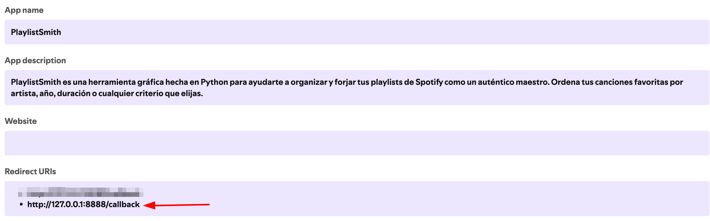
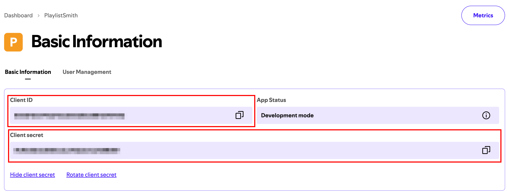

# 🎵 PlaylistSmith - Your Spotify Playlist Manager

**PlaylistSmith** is a desktop application that allows you to manage and organize your Spotify playlists in a simple and intuitive way. With a modern and user-friendly interface, you can sort your favorite songs based on different criteria.

> 🎧 Tired of disorganized playlists?  
> 🔥 Turn chaos into order with PlaylistSmith!

<p align="center">
  
  
  
</p>

## ✨ Key Features

- 🔐 Secure authentication with your Spotify account
- 🎵 View all your playlists
- 🧠 Sort by multiple criteria:
  - Artist (A-Z / Z-A)
  - Release date (newest / oldest)
  - Duration (longest / shortest)
  - Popularity (most / least popular)
- 🖥️ Modern and responsive graphical interface
- 💾 100% local: your data stays on your computer
- 🚀 Fast and lightweight

## 📋 Prerequisites

- Python 3.10 or higher
- A Spotify account (free or premium)
- Internet connection

## 🚀 Installation

1. **Clone the repository**
   ```bash
   git clone https://github.com/jabelzzz/playlistsmith.git
   cd playlistsmith
   ```

2. **Create a virtual environment**

   Using Pipenv (recommended for development):
   ```bash
   # Install pipenv if you don't have it
   pip install --user pipenv
   
   # Create and activate the virtual environment
   pipenv --python 3.10  # Make sure to use the Python >=3.10
   pipenv shell  # Activate the virtual environment
   ```

3. **Install dependencies**

   ```bash
   pipenv install --dev
   ```
   
   This will install all the necessary dependencies, including development ones.

4. **Set up Spotify credentials**
    - Create an app in the [Spotify Developer Dashboard](https://developer.spotify.com/dashboard/)
    - Add `http://127.0.0.1:8000/callback` as a Redirect URI in your app settings (use this exact URL for local testing)
    
    - Create a `config.env` file in the project root by copying `config.env.example` and filling values:
       ```bash
       cp config.env.example config.env
       # then edit config.env and paste your SPOTIPY_CLIENT_ID and SPOTIPY_CLIENT_SECRET
       ```
     - You can find you Client_ID and Client_secret at the start of the app
      
     
## 🎮 How to Use

1. **Start the application (simple, recommended for local testing)**
   ```bash
   # Install dependencies
   python3 -m pip install -U pip
   python3 -m pip install fastapi uvicorn spotipy python-dotenv

   # Run server
   python3 main.py
   ```

2. **Log in with Spotify**
   - Click on "Login with Spotify"
   - Your browser will open to authorize the application
   - Once authorized, you'll be redirected back to the application

3. **Select a playlist**
   - You'll see all your Spotify playlists
   - Click on the one you want to organize

4. **Sort your songs**
   - Use the buttons on the right to sort by:
     - Artist (A-Z)
     - Release date
     - Duration
     - Popularity

## 🛠️ Technologies Used

- **Language**: Python 3.10+
- **GUI Framework**: CustomTkinter
- **Spotify API**: Spotipy
- **Image Handling**: Pillow (PIL)
- **Environment Variables**: python-dotenv
- **Dependency Management**: Pipenv

## 📁 Project Structure

```
playlistsmith/
├── playlistsmith/           # Source code
│   ├── assets/              # Graphical resources (icons, images)
│   ├── services/            # Business logic
│   │   ├── sort_playlist.py # Playlist sorting
│   │   └── spotify_auth.py  # Spotify authentication
│   ├── ui/                  # User interface
│   │   ├── screens/         # Application screens
│   │   └── main_window.py   # Main window
│   └── __init__.py
├── .env.example             # Configuration example
├── Pipfile                  # Dependencies (Pipenv)
├── Pipfile.lock             # Lock file for reproducible builds
└── main.py                  # Entry point
```

## 🚢 Docker deployment

You can build and run the application using Docker Compose. The image installs dependencies from `Pipfile` so it always checks the declared libraries.

1. Copy your local config and set credentials:
```bash
cp config.env.example config.env
# Edit config.env and add SPOTIPY_CLIENT_ID and SPOTIPY_CLIENT_SECRET
```

2. Build and start with Compose:
```bash
docker compose build --pull
docker compose up -d
```

3. Verify the service:
```bash
curl -f http://127.0.0.1:8000/health
```

By default the service listens on port `8000`. If you registered a different `SPOTIPY_REDIRECT_URI` update `config.env` accordingly.

## 🤝 Contributing

Contributions are welcome! Please follow these steps:

1. Fork the project
2. Create a new branch (`git checkout -b feature/amazing-feature`)
3. Commit your changes (`git commit -m 'Add some amazing feature'`)
4. Push to the branch (`git push origin feature/amazing-feature`)
5. Open a Pull Request

## 📄 License

This project is licensed under the MIT License - see the [LICENSE](LICENSE) file for details.

## 🙏 Acknowledgments

- To Spotify for their excellent API
- To the developers of the open-source libraries used
- To you, for using PlaylistSmith 🎵

---

<p align="center">
  Made with ❤️ by <a href="https://github.com/jabelzzz">Jabel Álvarez</a>
</p>
